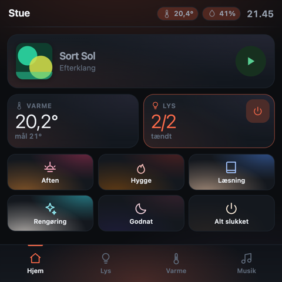
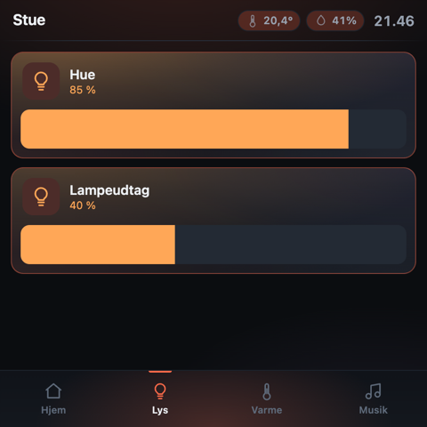
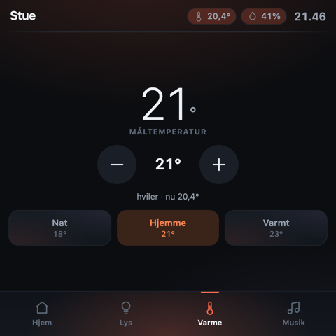
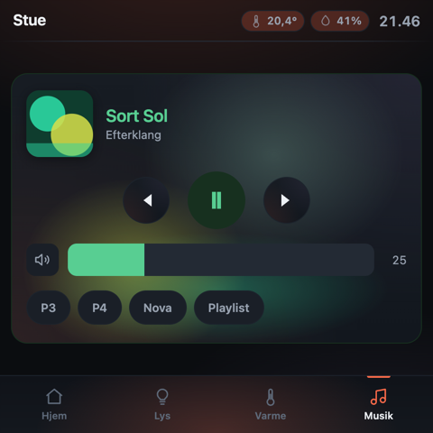
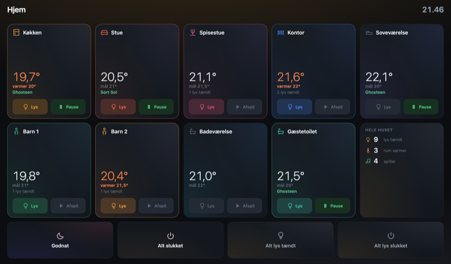
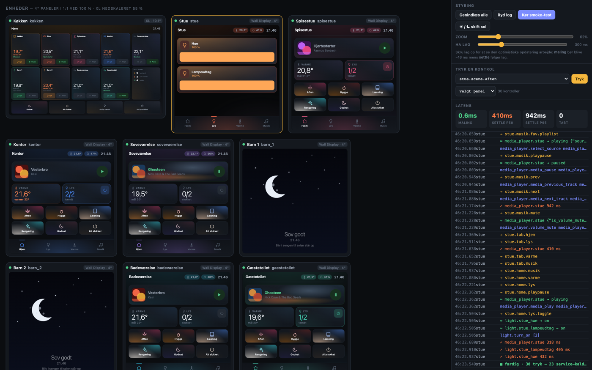

# hjem

Fast, custom Home Assistant wall panels for **Shelly Wall Display** hardware.

A standalone dashboard that speaks Home Assistant's WebSocket API directly
instead of running the Lovelace frontend — because the 4" Wall Display is a
quad Cortex‑A7 with 1 GB of RAM, and Lovelace is 3–5 MB of JavaScript.

**26 KB gzipped. 58 fps on the device. Taps paint in 0.5 ms.**

| Hjem | Lys | Varme | Musik |
|---|---|---|---|
|  |  |  |  |

<sub>4" panel at its real 480×480. Scene tiles preview the light they produce;
the now-playing aura is mixed from the album art's own colours. Light theme by
day, dark by night, following `sun.sun`.</sub>

| Wall Display XL — whole house | Debug suite — all 9 panels at once |
|---|---|
|  |  |

---

> ### ⚠️ Work in progress
>
> Built for one specific house and published because the hardware findings and
> the performance work are useful to others — not because it is a product.
>
> - The shipped `rooms.example.yaml` is a nine-room Danish setup with Hue,
>   Wavin floor heating and Sonos. It is the single source of truth, so
>   adapting it is mostly editing one file — but you *will* be editing it.
> - The UI is in Danish. There is no i18n layer; strings are inline.
> - **Only one of the nine panels has ever run this.** The Wall Display XL
>   overview has never been on real hardware.
> - Several features are unproven in daily use: the children's sleep clock has
>   only been tested on a bench, and scene tiles do nothing until you create
>   the scenes in HA.
> - There is no upgrade path, no versioning, and things will move.
>
> See [State of play](#state-of-play) for the honest list.

---

## Contents

- [What it does](#what-it-does)
- [Hardware](#hardware)
- [Quick start](#quick-start)
- [Making it yours](#making-it-yours)
- [Requirements](#requirements)
- [Findings](#findings)
- [Why this is not a Lovelace dashboard](#why-this-is-not-a-lovelace-dashboard)
- [How "instant" is achieved](#how-instant-is-achieved)
- [Design](#design)
- [Layout](#layout)
- [The debug suite](#the-debug-suite)
- [Tests](#tests)
- [Getting a panel onto the dashboard](#getting-a-panel-onto-the-dashboard)
- [Controlling the panels: `hjemctl`](#controlling-the-panels-hjemctl)
- [Development workflow](#development-workflow)
- [Vågeur — the children's sleep clock](#vågeur--the-childrens-sleep-clock)
- [Going live](#going-live)
- [ShellyElevate](#shellyelevate)
- [Files](#files)
- [State of play](#state-of-play)

---

## What it does

| | |
|---|---|
| **Lys** | Philips Hue + Shelly Pro relays, with each bulb's real colour temperature reflected in the UI |
| **Varme** | Wavin floor heating, per-room zones |
| **Musik** | Sonos, with the now-playing aura mixed from the album art's own colours |
| **Scener** | tiles that *preview the light they produce* — warm and dim for Hygge, cool and bright for Rengøring |
| **Vågeur** | a moon-to-sun sleep clock for the children's rooms |

Dark at night, light by day, following `sun.sun` rather than a clock. One
accent colour per room.

## Hardware

Built and measured on a **Shelly Wall Display** (`SAWD-0A1XX10EU1`, "Stargate").
A Wall Display XL is supported in the layout but untested.

You do **not** need to modify the device: the generated
`dashboards/generated/hjem_kiosk.yaml` wraps the app in a full-bleed iframe view
that the stock Shelly HA app can open. [ShellyElevate](https://github.com/RapierXbox/ShellyElevate)
gives you a cleaner fullscreen result — see [Getting a panel onto the dashboard](#getting-a-panel-onto-the-dashboard).

## Quick start

Nothing here needs Home Assistant to be running — there is a mock.

```bash
git clone <this repo> && cd hjem
npm install
npm run gen                 # copies rooms.example.yaml → rooms.yaml on first run,
                            # then generates typed config, dashboards, HA package
npm run build               # → public/hjem.js
npm run mock                # mock HA + static server on :8125
```

Then open the debug suite, which renders **all nine panels at true device pixel
size** in one page:

```
http://localhost:8125/debug.html
```

Or a single panel:

```
http://localhost:8125/sovevaerelse          # short room URLs
http://localhost:8125/?room=kokken  # the XL overview
```

Worth trying immediately: drag **HA lag** to 1200 ms and tap a light. The tile
flips instantly while `SETTLE` climbs to 1200 ms — that gap is the whole
architecture.

## Making it yours

Everything derives from **`rooms.yaml`**, which `npm run gen` creates from
`rooms.example.yaml` on first run. It is gitignored, so your house never enters
version control — as are all the files generated from it. Edit it, run
`npm run gen`, rebuild.

```yaml
rooms:
  - slug: kokken
    accent: "#F59E2C"       # per-room accent, whole UI follows it
    name: "Køkken"
    display: xl             # xl | wd
    entities:
      lights:
        - { entity: "light.kokken_hue?", name: "Loft", kind: hue }
      climate: "climate.kokken?"
      media:   "media_player.kokken?"
```

A trailing `?` marks an unverified guess. Once your Home Assistant is up:

```bash
HA_URL=http://homeassistant.local:8123 HA_TOKEN=eyJ... node tools/discover.mjs
# review the report, then apply:
HA_URL=... HA_TOKEN=... node tools/discover.mjs --write
```

`discover.mjs` reads HA's area, entity and device registries, matches entities
to rooms **by area**, splits Hue from Shelly by device manufacturer, and
rewrites only the `?` placeholders — leaving every comment in the file intact.

Then deploy into Home Assistant's `www/`:

```bash
HA_CONFIG=/path/to/homeassistant HA_TOKEN=<long-lived-token> npm run deploy
```

Served at `/local/hjem/index.html?room=<slug>` — same origin as the WebSocket
API, so no CORS.

## Requirements

- **Node 20+** (built on 23)
- **Rust** only if you want `hjemctl`, the panel-control CLI
- **Home Assistant** for real data; the mock covers everything else
- Chrome, for the test suite (`tools/uitest.mjs` uses Playwright with
  `channel: chrome`)

---

## Findings

Everything here was measured on a real device. It is written down because
Shelly's published specification is wrong in two places, the community guides
are wrong in one, and none of it is documented anywhere else I could find.

### 1. The hardware is not what the spec sheet says

Shelly lists the Wall Display as **MTK6580 / Android 11**. It is neither.

```bash
adb connect 192.168.1.50:5555
adb shell getprop ro.product.model          # Stargate
adb shell getprop ro.build.version.release  # 7.0     ← not 11
adb shell grep Hardware /proc/cpuinfo       # MT8321  ← not MTK6580
adb shell wm size ; adb shell wm density    # 720x720 ; 240
adb shell dumpsys package com.google.android.webview | grep versionName
```

| | Published | **Actual** |
|---|---|---|
| SoC | MTK6580 | **MT8321** — quad Cortex‑A7, ARMv7 32‑bit, 1.3 GHz |
| Android | 11 | **7.0** (SDK 24) |
| WebView | — | **Chrome 119** |
| RAM | 1 GB | 982 MB total, ~513 MB available |
| Screen | 4" | **720×720 physical, density 240** |
| Touch | — | 5 points |

**Android 7 with Chrome 119 is the surprising combination.** The OS is from
2016; the rendering engine is current. Modern JavaScript and CSS are fine —
but do not assume it, because the WebView is updated independently and another
unit may be older. This project still avoids `color-mix()` (Chrome 111+) and
derives its colour ramps in JS for that reason.

### 2. Screen size: 720×720 physical is **480×480 CSS**

Density 240 means `devicePixelRatio` is 1.5, so the CSS viewport is
`720 / 1.5 = 480`. Design against **480×480**.

This is easy to get wrong. Mid-project a touch event logged at `y ≈ 704` and I
concluded the panel must be ~720 CSS px tall and the whole layout was wrong.
It wasn't — the device logs touches in *physical* pixels. Confirm with the
browser, not with the OS:

```bash
# serve the repo, then open this on the panel itself
http://<your-machine>:8125/measure.html
```

`public/measure.html` reports CSS viewport, DPR, cores, sustained FPS and real
touch→paint latency, and **POSTs the results back** to `measurements.jsonl` on
the dev machine — reading numbers off a 4" screen is miserable.

### 3. Performance benchmark

`public/anim.html` is a live benchmark with an FPS meter and switchable loads.
Serve it, open it on the panel, and tap through the modes:

```bash
npm run mock
curl 'localhost:8125/__show?p=anim.html'   # pushes it to a kiosk-locked panel
```

Measured on the panel at 480×480:

| Load | FPS |
|---|---|
| Static gradients *(what this ships)* | **60** |
| Transform / opacity CSS animation | **58** |
| Animated GIF, 800 KB | **59** |
| SVG — `transform` + `stroke-dashoffset` | **48–55** |
| Animated gradient, fullscreen | **35** |
| `filter: blur()` + animated `box-shadow` | **32** |

**The rule: compositor work is free, rasterisation work is not.**

- `transform` and `opacity` composite — the GPU moves an existing layer.
- Gradients, blur and shadows **repaint** — the CPU redraws pixels every frame.
- Images are cheap because a GIF decodes once into a texture, then composites.
  A full-screen animated GIF costs less than one animated gradient.
- Static gradients cost nothing at all: painted once, then cached. This is why
  the UI is full of gradients but none of them move.

A useful corollary: 35 fps is perfectly smooth to the eye for a **transition**.
It is only a problem for something animating *permanently* on a wall panel,
where it means the GPU never idles. Spend freely on transitions; spend nothing
on decoration that runs all night.

To capture it yourself:

```bash
adb shell screenrecord --time-limit 20 /sdcard/perf.mp4
adb pull /sdcard/perf.mp4
adb exec-out screencap -p > frame.png      # single frame
```

### 4. Enabling developer mode and ADB

**You do not need mtkclient.** A widely-linked Home Assistant community guide
says you must erase device metadata over USB with `mtk e metadata,userdata`,
which breaks the stock Shelly app. That describes an older, harder path.

The [ShellyElevate](https://github.com/RapierXbox/ShellyElevate) wiki documents
the real one — **on the device screen**:

> `Settings → About Device`. You'll see two lines, the firmware version and the
> hardware revision. Tap them in this order:
>
> ```
> F   H   F   F   H   F   H   H
> ```
>
> `F` is the firmware version line, `H` is the hardware revision line. After the
> last tap, developer mode is on.

Eight taps, alternating between those two lines. There is **no on-screen
confirmation** — check whether a *Developer options* entry has appeared in
Settings. Nothing about timing is documented; tapping about once a second
worked. Disable the screensaver first, or it can bounce you back to the home
screen mid-sequence.

Then enable ADB over network in Developer options, and from your machine:

```bash
adb connect <panel-ip>:5555
adb devices                       # should list "Stargate"
```

**There is no SSH** — the device runs Android, not Linux with sshd. ADB is the
equivalent, and gives you a root-less shell plus:

```bash
adb exec-out screencap -p > panel.png                 # see the screen
adb shell input tap <x> <y>                           # drive it (physical px)
adb shell screenrecord --time-limit 30 /sdcard/x.mp4  # record it
adb shell am start -a android.intent.action.VIEW -d "http://…"
adb install -g some.apk
```

> **Security:** ADB over Wi-Fi has **no authentication**. Anyone on your LAN can
> control the panel. Turn it off when you are not actively working:
> ```bash
> curl -X POST 'http://<panel>:8080/settings' -d '{"adbWifiEnabled":false}'
> ```

### 5. Things that cost hours

- **The Shelly app cannot open an arbitrary URL.** It opens *Home Assistant
  dashboards*. The 2.7.0 "additional dashboards" feature adds more Shelly tile
  pages, not web pages. Workaround: `dashboards/generated/hjem_kiosk.yaml`
  wraps this app in a full-bleed `iframe` card in panel mode, which the Shelly
  app is happy to open.
- **ShellyElevate's screensaver is on by default, 45 s idle.** That, not
  Shelly's own settings, is what blanks the screen. Its `SettingsActivity` is
  not exported so `am start` cannot reach it after first run — but it exposes
  an HTTP API:
  ```bash
  curl 'http://<panel>:8080/settings'
  curl -X POST 'http://<panel>:8080/settings' -H 'content-type: application/json' \
    -d '{"screenSaver":false,"automaticBrightness":false,"minBrightness":8}'
  ```
- **The Shelly app draws a floating overlay** (logo + back arrow) on top of
  everything, including other apps. Remove it surgically rather than disabling
  the app — it still feeds its sensors to HA:
  ```bash
  adb shell appops set cloud.shelly.stargate SYSTEM_ALERT_WINDOW deny   # allow = undo
  ```
- **The Shelly app is the launcher** and pulls itself back to the foreground, so
  `am start` on a browser gets pushed behind it. Use Elevate, or the HA route.
- **`fwcdn.shelly.cloud` serves a private CA certificate** (`O=Allterco`). curl
  rejects it with exit 60; the devices ship that CA and are fine. If you are
  debugging a firmware download from a laptop, this looks like an outage and
  is not one.
- **Nine panels in one page exhaust Chrome's connection limit.** The debug suite
  renders nine live iframes; each holding a persistent SSE connection for hot
  reload exceeds the six-per-host cap for HTTP/1.1, and the last panels never
  finish loading. The harness now holds one connection and relays over
  `postMessage`.
- **`Ui.Tap` over Shelly RPC does not actually touch the screen.** It returns
  success and logs nothing. Use `adb shell input tap`.
- **Never tap blind.** `adb shell input tap` with guessed coordinates will land
  in another app's settings. Screenshot first, every time.

### 6. The device's own RPC is excellent

Firmware 2.7.4 exposes **189 local RPC methods** over plain HTTP — no cloud, no
HA, no app. Sensors, relay, screen, media, scripting, virtual components:

```bash
curl 'http://<panel>/rpc/Shelly.ListMethods'
curl 'http://<panel>/rpc/Temperature.GetStatus?id=0'
curl 'http://<panel>/rpc/Ui.GetConfig'
```

There is also a debug log stream — the only window into the Android side:

```bash
curl -X POST 'http://<panel>/rpc' -H 'content-type: application/json' \
  -d '{"id":1,"method":"Sys.SetConfig","params":{"config":{"debug":{"websocket":{"enable":true}}}}}'
websocat 'ws://<panel>/debug/log'      # or: hjemctl logs <room>
```

This is what `hjemctl` wraps. See [Controlling the panels](#controlling-the-panels-hjemctl).

## Why this is not a Lovelace dashboard

**The hardware cannot run the Home Assistant frontend well, and no amount of
YAML tuning changes that.**

The MTK6580 is a 2015-era budget *phone* chip. Home Assistant's Lovelace
frontend is a 3–5 MB Lit/custom-element bundle; parsing and running that on a
Cortex-A7 with 1 GB of RAM is where the lag comes from, before a single card
renders. Shelly's own support notes
[say as much](https://support.shelly.cloud/en/support/solutions/articles/103000390514-shelly-wall-display-xl-slow-performance-with-home-assistant-how-to-fix-it)
and recommend simplifying dashboards rather than fixing the device.

So this repo is a **standalone panel app that speaks HA's WebSocket API
directly**. Same Home Assistant, same auth, same services, same live state —
without the frontend.

```
hjem.js   66 KB raw · 18 KB gzipped
Lovelace  3–5 MB of JS
```

Measured in real Chrome at 480×480 with a **900 ms** simulated HA round trip:

```
DOM updated after tap     0.5 ms   (synchronous, zero frames waited)
Painted                  15.6 ms   (one frame)
HA confirmed            ~470 ms    (p50, mock lag 300 ms)
```

You give up the Lovelace card ecosystem and the visual editor. On nine panels of
this hardware, that trade is worth making. A generated Lovelace dashboard still
exists (`dashboards/generated/hjem.yaml`) for phones and debugging.

---

## How "instant" is achieved

Four things, in order of how much they matter:

**1. Optimistic state (`src/ha/store.ts`).**
A tap paints the *predicted* result immediately and reconciles when HA's echo
arrives. HA's real round trip — websocket → Hue bridge → bulb → `state_changed`
back — is 150–600 ms. Nothing waits for it.

Reconciliation is the subtle part:
- truth matches the guess → drop the guess, confirmed
- truth *contradicts* the guess → keep the guess until it expires, because a
  contradicting update this soon is almost always the stale echo of the state we
  just changed. Snapping back and forward again is the flicker we're avoiding.
- guess expires unconfirmed after 2.5 s → truth wins, UI self-heals

**2. Synchronous flush on input.** Predictions dispatch in the same task as the
`pointerdown`, not on the next animation frame. There is exactly one prediction
per gesture, so there is nothing to batch, and a rAF hop would add a whole frame
to the one interaction where latency is most visible. Inbound HA deltas *are*
rAF-batched — a Hue group emits ~10 events in a few ms.

**3. `pointerdown` / `pointerup`, never `click`.** Android WebView delays
`click` by 80–300 ms. `touch-action: manipulation` removes most of it; pointer
events remove all of it and give the down/up split — press feedback on down,
action on up, with a 12 px slop box (what native does).

**4. Indexed dispatch.** Tiles subscribe to specific entity ids. A light
changing in the bathroom never wakes the living-room tiles. A tile watching
three entities repaints once per frame, not three times.

### The CSS rules that are not negotiable

Enforced by test (`tools/uitest.mjs`) and documented in `src/ui/tokens.css`:

- **no `filter` / `backdrop-filter`** — no GPU path on Mali-400, silently falls
  back to software rasterisation
- **no animated `box-shadow`** — repaints the whole layer every frame
- **no gradients on moving parts** — a gradient under `transform` is
  re-rasterised each step. Slider fills are solid colours for this reason.
- **no web fonts** — blocks first paint; `system-ui` is already resident
- **no photographic backgrounds** — 1 GB RAM
- animate **`transform` and `opacity` only**

Static gradients are fine — painted once, then cached. That is where the visual
polish comes from.

---

## Design

Dark by default, light during the day, one accent colour per room.

**Day/night follows `sun.sun`, not a clock.** HA already computes real
sunrise/sunset for your coordinates; in Denmark that swings ~7 hours across the
year. A fixed 07–21 rule would leave the bedroom panel glaring white before dawn
in December. Falls back to a time window if `sun.sun` is unavailable.
Configure in `rooms.yaml → theme`.

### State-aware gradients

Gradients here are not decoration — each one encodes state, which is the only
reason they earn their cost on this hardware.

**Scene tiles preview the light they produce.** Each scene declares a `mood` in
`rooms.yaml`:

```yaml
- { id: hygge,     name: "Hygge",     mood: { k: 2000, level: 0.30 } }
- { id: rengoring, name: "Rengøring", mood: { k: 5800, level: 1.00 } }
```

`k` is colour temperature in kelvin, `level` is 0–1 brightness. The tile renders
that as a soft pool of light: Hygge is deep amber and dim, Rengøring is cool
white and bright, Alt slukket is essentially black. You pick a scene from its
swatch without reading the label. Set these to match what the scene actually
does in HA.

**Light tiles show the bulb's real colour.** `color_temp_kelvin` (or `rgb_color`
in colour mode) is converted to RGB via Tanner Helland's approximation, and the
tile's glow, icon, status text and brightness bar all take that colour, at an
intensity scaled by actual brightness. Dimming a Hue visibly dims the tile.
A Shelly Pro relay reports no colour, so it falls back to a warm 2700 K.

**The now-playing card** gets three soft radial blobs. Each blob's falloff is
tuned to reach zero *before* the card edge — otherwise the rounded rect slices
through a bright part of the gradient and you get a visible rectangular seam.

None of this uses `filter: blur()`, which has no GPU path on Mali-400. Radial
falloff is already soft. Gradients are written to the DOM only when the value
actually changes, since assigning `backgroundImage` invalidates the layer and
would otherwise defeat `contain: paint`.

**Per-room accents.** Each room has an `accent:` in `rooms.yaml`. The full ramp
(text colour, soft fill, hairline, wash) is derived in JS, not with CSS
`color-mix()` — that needs Chrome 111+, and an un-updated Android 11 WebView can
be Chrome 90. Accents are applied as custom properties, so they can be set on
`:root` (whole panel) *or* on a single element — which is how each room card on
the kitchen XL carries its own room's colour, and how opening a room from the XL
makes the detail view adopt that room's accent.

Accent text is darkened automatically on light backgrounds to stay legible.

---

## Layout

**4" panels** — four tabs: `Hjem · Lys · Varme · Musik`. All four panes are
built once and kept in the DOM; switching tabs toggles a class. Rebuilding a
pane per switch would cost 40–80 ms of layout on an A7. Budget: 900 DOM nodes
(currently 182).

**Kitchen XL** — whole-house grid: all nine rooms with temperature, target,
now-playing, and per-room light + play/pause without opening anything. Tapping a
room slides in that room's full panel — the *same* `buildPanel` the 4" displays
run, so there is one implementation of a room. Panels are built lazily on first
open, then cached. Budget: 2500 nodes (currently 391).

---

## The debug suite

`http://localhost:8123/debug.html` — all nine panels at true device pixel size,
in one page, driven from your PC.

- live **keyed event stream**: every tap, service call, prediction and settle
- **latency stats**: paint time vs HA settle p50/p95, and lost commands
- **HA lag slider** (0–1200 ms) — crank it up and watch paint stay at ~16 ms
  while settle follows the lag. That gap is the entire point of the app.
- **press any control by key** on one panel or all nine at once
- **smoke test** — presses every registered control in sequence and reports
  taps → service calls → lost
- **sun toggle** to check both themes

Every interactive control has a stable `data-key` (`stue.lys.0.toggle`,
`kokken.varme.plus`, `ov.room.kontor`) and is addressable from the harness via
`postMessage`. That's what makes nine panels testable without nine walls.

---

## Tests

```bash
npm run mock &        # required by both suites
node tools/selftest.mjs   # store semantics + HA protocol conformance  (17)
node tools/uitest.mjs     # real Chrome, real viewports, real taps     (30)
```

`selftest` covers the tricky store behaviour directly: stale-echo handling,
expiry, numeric-attribute tolerance, indexed dispatch, repaint coalescing.

`uitest` drives the actual bundle in real Chrome at 480×480 and 1280×752 and
asserts on things that are easy to regress: no overflow, no blur anywhere, every
button ≥ 40×40, tab switching doesn't rebuild the DOM, DOM node budgets, the
optimistic paint happens synchronously, theme follows the sun, and all nine room
accents are distinct.

---

## Getting a panel onto the dashboard

The Shelly app can only open Home Assistant dashboards, **not arbitrary URLs**
(the 2.7.0 "additional dashboards" feature is extra *Shelly* tile pages). Two
routes:

**A — via Home Assistant, no device modification.** `dashboards/generated/hjem_kiosk.yaml`
wraps the panel app in a full-bleed `iframe` card in panel mode, one view per
room. The Shelly HA app opens that dashboard and is none the wiser.

**B — ShellyElevate**, which is what this panel runs. Replaces the Shelly shell
with a fullscreen WebView pointed anywhere. Steps that actually worked:

1. **Developer mode**, on the device: `Settings → About Device`, tap the
   *firmware version* and *hardware revision* lines in the order
   **F H F F H F H H**. No mtkclient, no bootloader unlock — a community guide
   claiming otherwise is describing an older, harder path.
2. `adb connect <ip>:5555`
3. `adb install -g ShellyElevateV2-*.apk`
4. `adb shell appops set me.rapierxbox.shellyelevatev2 WRITE_SETTINGS allow`
   and `adb shell dumpsys deviceidle whitelist +me.rapierxbox.shellyelevatev2`
5. Launch it; its settings open on first run. Set the dashboard URL.

**Remove the Shelly overlay** (the floating logo + back arrow that sit on top of
everything) without disabling the Shelly app:

```bash
adb shell appops set cloud.shelly.stargate SYSTEM_ALERT_WINDOW deny   # `allow` to undo
```

**Elevate has an HTTP settings API on :8080** — far easier than its edge-tap
gesture:

```bash
curl 'http://<panel>:8080/settings'                       # read everything
curl -X POST 'http://<panel>:8080/settings' \
  -H 'content-type: application/json' \
  -d '{"screenSaver":false,"automaticBrightness":false,"minBrightness":8}'
```

Its screensaver is **on by default with a 45 s idle delay** — that is what
blanks the screen, not Shelly's settings.

## Controlling the panels: `hjemctl`

A Rust CLI (1.5 MB static binary) that talks to the displays over their local
Gen2 RPC. No cloud, no app, no Home Assistant — works with HA switched off.

```bash
hjemctl discover                    # mDNS, registers what it finds
hjemctl assign <device-id> stue  # validated against rooms.yaml slugs
hjemctl ls | sensors all | watch all
hjemctl relay <room> on|off|toggle
hjemctl brightness <room> 40|auto
hjemctl logs <room> --grep webview  # the device's internal debug stream
hjemctl update | reboot | backup | rpc <room> <Method> [k=v]
hjemctl mcp                         # MCP server over stdio
```

Targets resolve as **room slug → device id → IP → `all`**, and fan out
concurrently so one dead panel never blocks the others.

`hjemctl mcp` is registered in `.mcp.json`, exposing 8 tools so an agent can
read sensors and drive screens directly.

## Development workflow

```bash
npm run mock                        # fake HA + static server on :8125
npm run watch                       # esbuild, rebuilds on change
```

The dev server pushes a reload over SSE when the bundle changes, so a
wall-mounted panel refreshes itself. Because a kiosk app is locked to one URL,
the server also decides *what that URL serves*:

```bash
curl 'localhost:8125/__show?p=anim.html'          # panel shows the benchmark
curl 'localhost:8125/__show?room=barn_2'  # panel shows another room
curl 'localhost:8125/__show?p='                   # back to the dashboard
curl 'localhost:8125/__demo?s=30'                 # play a whole night in 30 s
curl 'localhost:8125/__sun?s=up'                  # flip day/night
curl 'localhost:8125/__lag?ms=900'                # simulate a slow HA
```

`public/measure.html` on a real panel POSTs its canvas size, FPS and touch
latency back to `measurements.jsonl`. `public/anim.html` is the animation
benchmark that produced the table above.

## Vågeur — the children's sleep clock

A moon-to-sun timer for the kids' rooms, in `src/ui/wake.ts`. Configured per
room under `wake:` in `rooms.yaml`.

Three constraints drove the design:

1. **A four-year-old cannot read "06:42."** The answer to "can I get up?" has to
   be a picture. The clock face is deliberately small.
2. **A bright panel in a dark bedroom is worse than no panel.** Night runs at 4 %
   and drives the device backlight over local RPC, not just CSS.
3. **Nothing animates continuously.** Everything is positioned from the clock and
   repainted every 20 s. Over a 90-minute sunrise that is ~270 steps, which
   reads as continuous without the GPU ever being busy.

Phases: `night` → `dawn` (90 min, from 05:30) → `morning` → `off`.

**It computes everything locally** so an HA restart at 3 a.m. cannot leave a
child's room dark or blazing — but it *reads* HA when available:

```
input_datetime.<room>_vaagetid   move tomorrow's wake time from a phone
input_boolean.<room>_vaageur     switch it off for a sleepover
```

Tapping the clock shows the normal panel for two minutes, then it returns by
itself — a child cannot switch it off for the night.

`node tools/wake-sim.mjs [room]` renders the whole cycle to a video;
`curl 'localhost:8125/__demo?s=30'` plays it on a real panel.

## Going live

Home Assistant was offline while this was built, so **every entity id in
`rooms.yaml` is a convention-based guess marked with `?`.** Nothing will work
until they're real.

**1. Discover the real entity ids**

```bash
HA_URL=http://homeassistant.local:8123 HA_TOKEN=eyJ... node tools/discover.mjs
# review the report, then:
HA_URL=... HA_TOKEN=... node tools/discover.mjs --write
```

Reads HA's area + entity + device registries, matches entities to rooms by area,
and splits lights by vendor (Hue vs Shelly Pro) using the device manufacturer.
Rewrites only the `?` placeholders, in place, leaving all comments intact.

**2. Regenerate and build**

```bash
npm run gen && npm run build
```

**3. Measure the real screen** — open `/local/hjem/measure.html` on the panel.
It reports CSS viewport, DPR, sustained FPS and real touch→paint latency, and
POSTs them back to the dev machine. Put the numbers
into `rooms.yaml → models.wd.canvas`.

**4. Deploy**

```bash
HA_CONFIG=/path/to/homeassistant npm run deploy
```

Copies into `www/hjem/`, served at `/local/hjem/` — same origin as the
WebSocket API, so no CORS.

**5. Point each panel at its room**

```
/local/hjem/index.html?room=kokken     ← XL
/local/hjem/index.html?room=stue
/local/hjem/index.html?room=sovevaerelse
```

First load asks for a long-lived access token (Profile → Security). Stored in
`localStorage` per device.

**6. Merge the HA package**

`config/packages/hjem_panels.yaml` holds the helpers the panels expect. In
`configuration.yaml`:

```yaml
homeassistant:
  packages: !include_dir_named packages
```

**7. Create the scenes.** `discover.mjs` reports which of the six per-room
scenes don't exist yet. Create them in HA or trim the list in `rooms.yaml`.

---

## ShellyElevate

[ShellyElevate](https://github.com/RapierXbox/ShellyElevate) replaces the stock
Shelly shell with a fullscreen WebView you can point anywhere, and adds MQTT
hardware discovery, auto-brightness and screensavers. It is what these panels
run.

Install (after enabling developer mode — see [Findings §4](#4-enabling-developer-mode-and-adb)):

```bash
adb install -g ShellyElevateV2-*.apk
adb shell appops set me.rapierxbox.shellyelevatev2 WRITE_SETTINGS allow
adb shell dumpsys deviceidle whitelist +me.rapierxbox.shellyelevatev2
adb shell am start -n me.rapierxbox.shellyelevatev2/.MainActivity
```

Its settings open on first launch. Afterwards use the HTTP API on `:8080` —
see [Findings §5](#5-things-that-cost-hours) for the screensaver and overlay
settings you will want to change.

## Files

```
rooms.yaml              single source of truth — rooms, entities, accents, theme
  ↓ npm run gen
src/generated/config.ts   typed config baked into the bundle
config/packages/          HA package (helpers, scripts)
dashboards/generated/     Lovelace fallback for phones / debugging
public/rooms.json         consumed by the debug suite

src/ha/
  connection.ts   WebSocket client — subscribe_entities compressed deltas,
                  heartbeat, backoff. ~3 KB instead of home-assistant-js-websocket
  store.ts        entity store + optimistic overlay + reconciliation
  actions.ts      predict-then-fire service calls, per domain
src/ui/
  tokens.css      design tokens, both themes, the forbidden-CSS list
  theme.ts        sun-driven day/night + accent ramp maths
  press.ts        pointerdown/up interaction + drag sliders
  tiles.ts        light / climate / media / scene / sensor tiles
  panel.ts        4" four-tab room shell
  overview.ts     XL whole-house shell
  bus.ts          keyed debug events + remote control channel

tools/
  generate.mjs  rooms.yaml → everything
  build.mjs     esbuild, CSS inlined, enforces the size budget
  mock-ha.mjs   fake HA: auth, subscribe_entities, call_service, injectable lag
  discover.mjs  match real HA entities to rooms
  deploy.mjs    copy into HA www/
  selftest.mjs  store + protocol tests
  uitest.mjs    real-browser UI tests
  shot.mjs      screenshots
```

## State of play

**Done and verified on real hardware:**
- Dashboard runs fullscreen on the bedroom panel, reading live HA data
- 58 fps sustained; all performance budgets confirmed against the real SoC
- 480×480 CSS canvas confirmed (720×720 @ DPR 1.5)
- Firmware updated 1.2.5 → 2.7.4; ShellyElevate installed; overlay and
  screensaver disabled
- Home Assistant running in Docker, the Shelly registered (12 entities), 9 areas
  created, `discover.mjs` validated against a live entity registry
- `hjemctl` + MCP server; hot reload and dev channel working end to end

**Still open:**
- **54 entity ids are still guesses.** Only the bedroom panel's own three
  sensors are real. Hue, Wavin and Sonos do not exist in HA yet — run
  `npm run discover --write` once they do.
- **The HA instance is a throwaway Docker container** on the laptop. Everything
  moves to the real HA by re-running `discover.mjs` + `deploy.mjs` against it.
- **Scenes do not exist in HA.** The six per room are referenced but uncreated,
  so tapping a scene tile currently does nothing but change the panel's mood.
- **Scene moods are guesses.** Tune `k` / `hue2` / `level` in `rooms.yaml` to
  match what the scenes actually do, or the swatches are decorative.
- **Only one panel exists.** The XL and the other seven 4" units are untested;
  the XL overview shell has never run on real hardware.
- **The sleep clock has never run in a child's room** — validated in Chrome and
  on the bedroom panel via a room override only.
- **Temperature hierarchy is incomplete.** Currently Wavin → panel sensor. The
  BLU H&T should sit above both once paired; the BLE observer is enabled and
  waiting for it.
- **ADB over Wi-Fi is enabled and unauthenticated.** Anyone on the LAN can
  control the panel. Turn it off when not actively developing:
  `curl -X POST http://<panel>:8080/settings -d '{"adbWifiEnabled":false}'`
- **The HA token sits in `public/panel-config.json`**, gitignored but served at
  `/local/hjem/panel-config.json`. Deliberate — the alternative was typing a
  200-character JWT on a 4" touchscreen — but worth revisiting.
